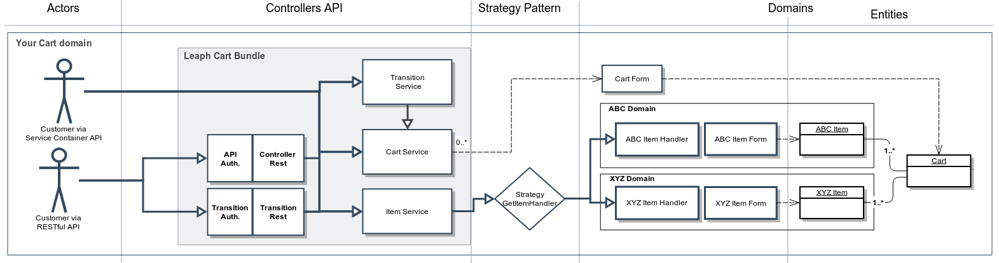

Flow
====

Il flusso è il cuore dell'archietettura di leaph.
Un customer può utilizzare le API, tramite interfaccia RESTful o tramite services.
I vari controller sono istanziati durante con la dependency injection, cosi come i services per il cart e l'item.
Il cart service usa il cart form per effettuare le modifiche all'oggetto cart.

Il flusso più lungo è quello per aggiungere un oggetto nel carrello.
Il customer vuole aggiungere un prodotto esempio libro, con delle opzioni esempio la scelta della copertina rigida.
Quindi il customer dovrà chiamare aggiungi item al carrello, dato il carrello e dei parametri:
$this->container->get('leaphly_cart.full.cart.service')->postItem($cart, array $parameters)
possiamo ipotizzare che il carrello sia un oggetto carrello, e che i parametri contengono:

array(
'product_id' => 2,
'cover' => 'hard-cover'
)

A questo punto lo strategy pattern invocherà l'item handler 'corretto' per quel prodotto.
L'item handler chiamato BookItemHandler si preoccuperà di restituire un oggetto di tipo bookItem correttamente riempito.
Per avere più informazioni sul come il postItem riesca a ricavare il giusto 'ContextKey' per trovare il giusto ItemHandler,
si rimanda ai capitoli sul Family Product e Strategy Pattern.

